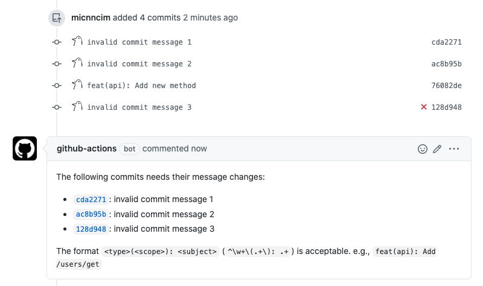

# Action Lint Commits

[![actions-workflow-test][actions-workflow-test-badge]][actions-workflow-test]
[![release][release-badge]][release]
[![license][license-badge]][license]



This is a GitHub Action to lint commits on a pull request.

## Inputs

|      NAME      |                            DESCRIPTION                            |   TYPE   | REQUIRED | DEFAULT |
|----------------|-------------------------------------------------------------------|----------|----------|---------|
| `github_token` | A GitHub token.                                                   | `string` | `true`   | `N/A`   |
| `regex`        | The regex for commit messages.                                    | `string` | `true`   | `N/A`   |
| `format`       | The output format of outputs.{matched_commits,unmatched_commits}. | `string` | `true`   | `N/A`   |

## Outputs

|        NAME         |                 DESCRIPTION                 |   TYPE   |
|---------------------|---------------------------------------------|----------|
| `matched_commits`   | The commits which match inputs.regex.       | `string` |
| `unmatched_commits` | The commits which don't match inputs.regex. | `string` |

## Example

```yaml
name: Lint Commits

on:
  pull_request_target:
    types: ["opened", "reopened", "synchronize"]

jobs:
  lint_commits:
    runs-on: ubuntu-latest
    steps:
      - name: Lint commits
        uses: actions-ecosystem/action-lint-commits@v1
        id: lint-commits
        with:
          github_token: ${{ secrets.GITHUB_TOKEN }}
          regex: '^\w+\(.+\): .+' # e.g.) "feat(api): Add /users/get"
          format: markdown

      - name: Post warning comment
        uses: actions-ecosystem/action-create-comment@v1
        if: ${{ steps.lint-commits.outputs.unmatched_commits != '' }}
        with:
          github_token: ${{ secrets.GITHUB_TOKEN }}
          body: |
            The following commits needs their message changes:

            ${{ steps.lint-commits.outputs.unmatched_commits }}

            The format `<type>(<scope>): <subject>` (`^\w+\(.+\): .+`) is acceptable. e.g., `feat(api): Add /users/get`

      - name: Fail when commit lint isn't been passed
        if: ${{ steps.lint-commits.outputs.unmatched_commits != '' }}
        run: exit 1

```

## License

Copyright 2020 The Actions Ecosystem Authors.

Action Lint Commits is released under the [Apache License 2.0](./LICENSE).

<!-- badge links -->

[actions-workflow-test]: https://github.com/actions-ecosystem/action-lint-commits/actions?query=workflow%3ATest
[actions-workflow-test-badge]: https://img.shields.io/github/workflow/status/actions-ecosystem/action-lint-commits/Test?label=Test&style=for-the-badge&logo=github

[release]: https://github.com/actions-ecosystem/action-lint-commits/releases
[release-badge]: https://img.shields.io/github/v/release/actions-ecosystem/action-lint-commits?style=for-the-badge&logo=github

[license]: LICENSE
[license-badge]: https://img.shields.io/github/license/actions-ecosystem/action-lint-commits?style=for-the-badge
